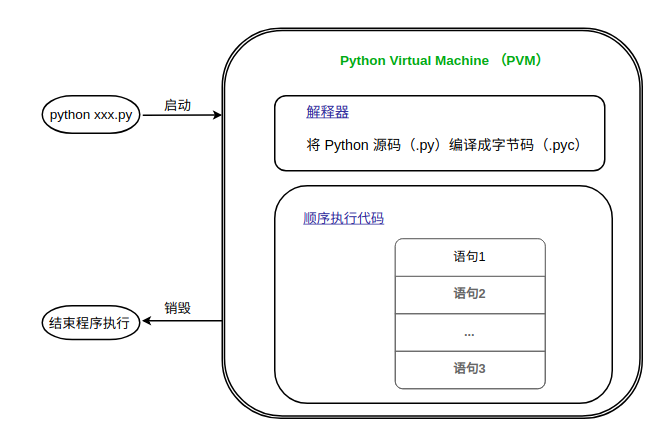

Python 虚拟机（ Python Virtual Machine，PVM ）。

在 Python 安装完成的时候，会产生一个 Python 虚拟机 (PVM) 和支持的基础库。基础库很好理解就是 Python 内置的基本模块。而 Python 虚拟机和系统虚拟机不同，它是一种称为程序的虚拟机，类似 Java 的虚拟机 (JVM)。 

# Python 虚拟机执行程序过程

当执行 Python 程序时，虚拟机启动，将 Python 源码 (.py) 翻译成字节码 (.pyc) 的形式，虚拟机在当前的上下文环境中一条一条的执行字节码，输出结果，并结束 Python 程序，销毁虚拟机。使用虚拟机的目的就是提供一个和平台无关的编程环境。

源码翻译成字节码的过程是通过在源码同目录下创建一个同名的（.pyc）文件。下一次运行程序时，如果源码没有改变，虚拟机将会跳过字节码文件的生成，否则重新翻译字节码文件。这个判断依据是通过对比源码文件和字节码文件的时间戳。还有另外一种情况，用户在源码目录下没有写入的权限，那么字节码将会在内存中生成，并在程序结束时丢弃。比起源码程序，字节码的运行速度要快的多。

> *源码文件被被翻译成字节码文件需要一个条件，源码作为模块通过 import 关键字引用到程序当中*

也就是说你通过 `python xxx.py` 执行程序，当前路径下不会生成 xxx.pyc 字节码文件，可以通过 `python -m xxx.py` 命令把 xxx.py 文件当做模块启动，这样就可以生成字节码文件。

