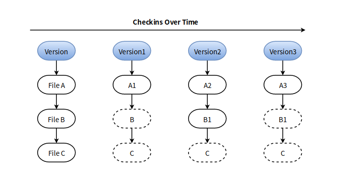
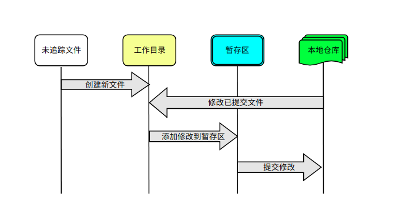

Git 是一个开源的分布式版本控制系统，可以高效的用于项目版本迭代中，基于每次修改或者各个版本间的比较，都可以清晰查看哪些人修改了哪些文件，并附带详细的修改说明信息。

GitHub 是用 Git 做版本控制的代码托管平台。在 GitHub 上，会保存一份需要进行版本控制的项目仓库。而你在任何地方都可以通过 GitHub 克隆一份完整的项目仓库，即使有一天 GitHub 发生故障，或者不让用了，你都可以通过任意一份本地克隆的仓库在 Gerrit（个人搭建类 GitHub 代码托管平台）上恢复项目的使用。

# Git 系统设计原理

## 各个版本如何记录文件

随着项目的发布，项目迭代的版本就会越来越多。每个项目版本都会记录属于此版本的所有文件的哈希值，文件的哈希值是基于文件的内容或目录结构计算出来的，所以通过文件的哈希值可以索引到文件。等到下一个版本的时候，有一部分的文件会被改变，相应的文件的哈希值就会被重新计算，然后替换当前版本对应此文件的哈希值，没有改变的文件，此版本会复制上一个版本的文件哈希值。

Git 一般只添加数据，一旦你提交修改到 Git 中，就很难再丢失数据。

> *每次提交修改，都可以被当成是一个版本进行标记*



从图中可以看到，每个版本对应的文件：
* version 含有文件 ：File A，File B，File C
* version1 含有文件 ：File A1（第一次修改），File B，File C
* version2 含有文件 ：File A2（第二次修改），File B1（第一次修改），File C
* version3 含有文件 ：File A3（第三次修改），File B1（第一次修改），File C

## 完全本地修改项目

每个本地仓库是远程仓库的完整克隆，即使远程仓库挂掉，可以通过任何一个本地仓库来恢复远程仓库。所以，对项目的修改可以完全放在本地，不需要担心网络问题，本地的操作几乎都是瞬间完成的，直到你完成所有的修改后，然后才需要联网把本地的修改同步到 GitHub，这样其他人如果也在开发这个项目，他们就能通过托管平台拉取最新的项目。

在本地修改项目需要理解工作区的概念：Git 仓库、工作目录以及暂存区域。



* Git 仓库：是项目历史版本存储的位置（committed 文件）
* 工作目录：默认显示最新项目版本对应的文件（modified 的文件和未跟踪文件）
* 暂存区域：将要被提交到 Git 仓库的修改文件（staged 文件）


# Git 仓库的操作

1. 选择项目的托管平台（最流行使用 GitHub，当然也可以自己搭建一个 Gerrit），并在平台上创建一个空项目
2. 从 GitHub 中克隆将项目到本地
3. 在本地对项目进行修改，并把修改内容提交到本地仓库
4. 同步本地仓库到 GitHub

## Git 系统配置

在 GitHub 中注册用户和邮箱地址，确保拥有一个远程的代码管理平台。否则下面填写的用户名、邮箱地址可以任意填，只是使用不了 GitHub。

    git config --global user.name {{ 用户名 }}
    git config --global user.email {{ 邮件地址 }}
    git config --global core.editor vim
    git config --global credential.helper store   # 登录 GitHub 记住密码

忽略某类文件的提交，在工作目录下面创建 `.gitignore` 文件，其内容：

```
    *.swp
    nohup.out
```

忽略 `.swp` 后缀文件的修改，忽略 `nohup.out` 文件和 `nohup.out` 文件夹下所有文件的修改。

## 本地获取远程仓库（GitHub）

克隆远程仓库到本地，本地仓库和远程仓库一模带一样。

    git clone https://github.com/{{ 用户名 }}/{{ 项目名称 }}

如果不使用 GitHub ，还可以通过下列命令初始化一个本地仓库：

    git init
    
## 本地仓库修改

### 添加修改到暂存区

修改的文件可能会有两种情况，一种是已提交过的文件，另一种是新添加未跟踪的文件。查看文件内容的修改情况：

    git diff [filename]
    
如果文件有修改错误，可以通过下列命令撤销文件的修改：
    
    git checkout                # 撤销所有被追踪文件的修改
    git checkout -- filename    # 撤销某个文件的修改
    
添加文件到暂存区：

    git add *           # 添加所有文件到暂存区
    git add filename    # 添加某个文件到暂存区

如果有些文件不能放在一起提交，单却一起提交到了暂存区，在暂存区中需要撤销文件：

    git reset           # 撤销所有暂存区的文件
    git reset filename  # 撤销暂存区的某个文件

### 提交暂存区的修改到本地仓库

当文件的修改真正提交到仓库中，才永远不会丢失：

    git commit              # 为本次提交写多行说明（例如添加附加信息：Change-Id）
    git commit -m "message"     # 本次提交只能有一行说明
    git commit --amend      # 合并到上一次的提交

查看提交信息：

    git log                     # 查看每次提交的 message
    git log --oneline --graph   # 查看历史分支结构
    git log --pretty=format:'%H' --name-only  # 查看哪些文件被修改

### 版本回滚

本地仓库回滚到指定的版本：

    git reset --hard [commid-id]

## 本地提交到远程仓库

对本地仓库的修改提交到远程仓库，确保修改的一致性，促进程序的持续集成。

    git push
    
    git reset --hard [commid-id]
    git push -f     # 强制推送到远程分支，用于远程仓库的回滚

当然如果是修改的别人的仓库，需要 Fork 一份仓库到自己账户下，和修改自己的仓库没有区别，然后在 GitHub 上创建一个 pull request 请求对方在对方的仓库上 Merge 自己对仓库的修改，如果对方同意了，当前的修改就会被提交到对方账号的仓库上。

